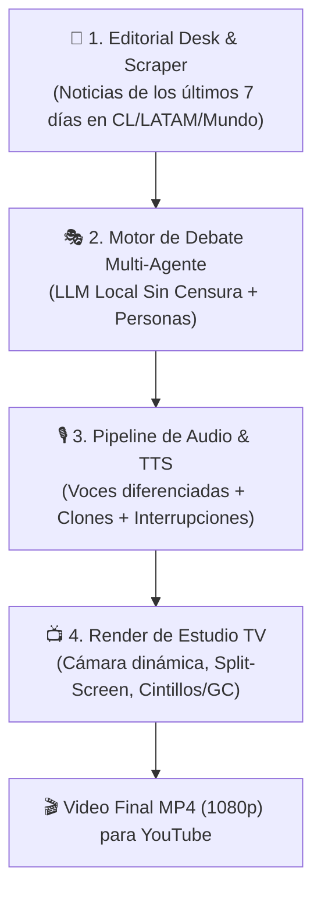

# 🏛️ Political Deathmatch

<div align="center">

[](https://www.typescriptlang.org/)
[](https://nodejs.org/)
[](https://openspec.dev/)
[](https://huggingface.co/HauhauCS/Gemma4-12B-QAT-Uncensored-HauhauCS-Balanced)
[](LICENSE)

**Simulador y Estudio de Televisión Automatizado de Debate Político Sin Censura con IA**

*Inspirado en programas de televisión de alta confrontación como "Sin Filtros" y "Tolerancia Cero", impulsado por modelos locales sin censura y una arquitectura Spec-Driven.*

</div>

---

## 📖 Visión del Proyecto

**Political Deathmatch** es una plataforma y pipeline automatizado diseñado para generar debates políticos audiovisuales de **15 a 20 minutos** listos para ser publicados en YouTube. 

El sistema enfrenta semanalmente a arquetipos y figuras históricas controvertidas (e.g. *Karl Marx, un Joven Incel, un Fanático Religioso, Dictadores o Políticos Populistas*) sobre la **pauta noticiosa real de los últimos 7 días** en Chile, Latinoamérica y el Mundo.



---

## 🏗️ Arquitectura del Sistema

El proyecto opera en cuatro capas totalmente desacopladas:

1. **Editorial Desk (Pauta Semanal):**
   - Ingesta multizona (Chile, LATAM, Mundo) mediante RSS/XML nativo en paralelo.
   - Filtro de ruido temático (descarta deportes, farándula banal y clima).
   - Generación de pauta estructurada con titulares escandalosos para el Generador de Caracteres (GC) y preguntas insidiosas del moderador.
2. **Motor Multi-Agente de Debate (Runtime):**
   - Orquestador con máquina de estados finitos (turnos, réplicas, interrupciones y nivel de tensión en el estudio).
   - Inyección de personalidades ideológicas extremas mediante RAG y perfiles psicológicos.
3. **Pipeline de Audio (TTS & Voice Stems):**
   - Síntesis de voz con motores locales (`Kokoro`, `Edge-TTS` o `XTTS v2`).
   - Pistas de audio independientes para soportar cuando dos panelistas se pisan la palabra.
4. **Video Studio Renderer:**
   - Estudio virtual con avatares reactivos al audio y conmutación automática de cámaras (primer plano, plano general, split-screen de combate).
   - Generador de Caracteres (GC) animado con titulares sensacionalistas.

---

## 🧠 Matriz de Modelos y Control de Tokens

Para optimizar el gasto de tokens durante el desarrollo y la ejecución:

### 1. Desarrollo del Código (Build-Time)
| Módulo | Herramienta | Modelo Primario | Pensamiento (*Thinking*) | Modelo de Backup |
| :--- | :--- | :--- | :--- | :--- |
| **Arquitectura & Orquestador** | Antigravity | `anthropic/claude-3-7-sonnet` / `gemini-2.5-pro` | **High** (8k tokens) | `deepseek/deepseek-r1` |
| **Scraper RSS & Pauta Editorial** | OpenCode / Antigravity | `google/gemini-2.5-flash` | **Off / Low** (1M contexto) | `deepseek/deepseek-chat` (V3) |
| **Prompts de Personajes (Marx, Incel)** | Antigravity | `anthropic/claude-3-7-sonnet` | **Medium** (4k tokens) | `meta-llama/llama-3.3-70b` |
| **Pipeline de Audio (TTS)** | OpenCode | `qwen/qwen-2.5-coder-32b` | **Off** (Código determinista) | `gemini-2.5-flash` |
| **Video Studio Renderer** | Antigravity | `anthropic/claude-3-7-sonnet` / `gemini-2.5-pro` | **Medium** (4k tokens) | `deepseek-chat` (V3) |

### 2. Generación del Debate (Runtime de Simulación)
- **Primario (único, $0 Tokens / Sin Censura):** `HauhauCS/Gemma4-12B-QAT-Uncensored-HauhauCS-Balanced` (`:Q4_K_M`, ~7.4 GB) corriendo en **Ollama** (`http://localhost:11434`).
- **Fallback (offline):** Sintetizador heurístico local. **OpenRouter desactivado** — el debate corre 100% local.

---

## 📐 Spec-Driven Development con OpenSpec

El repositorio sigue la metodología **Spec-Driven Development (SDD)** utilizando [OpenSpec](https://openspec.dev/).

```
political_deathmatch/
├── .agent/                     # Workflows y Skills para Antigravity
├── .opencode/                  # Comandos y Skills para OpenCode
├── openspec/
│   ├── config.yaml             # Configuración del esquema SDD
│   ├── specs/                  # Especificaciones vivas del sistema
│   └── changes/                # Propuestas de cambio por feature
├── AGENTS.md                   # Guardrails arquitectónicos y protocolo de handoff
├── HANDOFF.md                  # Bitácora de continuidad entre sesiones
└── src/                        # Código fuente de producción
```

### Slash Commands Disponibles (Antigravity & OpenCode)
- `/opsx-propose "titulo"`: Crea una propuesta de cambio con diseño, tareas y deltas de spec.
- `/opsx-apply [change-id]`: Implementa el código de las tareas aprobadas.
- `/opsx-archive [change-id]`: Archiva un cambio completado y actualiza las especificaciones vivas.

---

## 🚀 Inicio Rápido

### Requisitos Previos
- **Node.js:** v22.15.1 o superior.
- **OpenSpec CLI:** `npm install -g @fission-ai/openspec@latest`

### 1. Clonar e Instalar
```bash
git clone https://github.com/geoidegeoidal/political_deathmatch.git
cd political_deathmatch
npm install
```

### 2. Configurar Variables de Entorno (Opcional)
Crea un archivo `.env` en la raíz (si deseas utilizar la API de Gemini para la pauta; de lo contrario el sistema utiliza Ollama local o el sintetizador heurístico local):

```env
# GEMINI_API_KEY="tu-clave-gemini"   # Pauta editorial (opcional; sin ella usa Ollama/heurístico)
# OLLAMA_HOST="http://localhost:11434"
```

> **OpenRouter desactivado:** el debate y la pauta corren solo con Ollama local + fallback heurístico. No se necesita clave de OpenRouter.

### 3. Generar la Pauta Semanal en Vivo
Descarga noticias reales de los últimos 7 días de Chile, LATAM y el Mundo, y genera la pauta del debate:

```bash
npm run pauta
```

El resultado se exporta a [`weekly_agenda.json`](file:///c:/Users/Tokyotech/sideprojects/political_deathmatch/weekly_agenda.json) con los bloques estructurados, los cintillos de TV y los gatillantes por personaje.

### 4. Simular el Debate Televisivo (4 Bloques)
Ejecuta el orquestador multi-agente sobre la pauta generada (Ollama local sin censura → sintetizador heurístico local):

```bash
npm run debate
# o: npx tsx src/cli/simulate-debate.ts
```

El guion de producción se exporta a [`debate_transcript.json`](file:///c:/Users/Tokyotech/sideprojects/political_deathmatch/debate_transcript.json) con turnos, emociones, cintillos (GC), marcas de interrupción y directivas de cámara.

> **Runtime sin censura (recomendado):** instala [Ollama](https://ollama.com) y descarga el modelo local:
> ```bash
> ollama pull hf.co/HauhauCS/Gemma4-12B-QAT-Uncensored-HauhauCS-Balanced:Q4_K_M
> ```

---

## 🗺️ Roadmap de Desarrollo

- [x] **Fase 1.1:** Setup global de OpenSpec + Soporte Antigravity & OpenCode.
- [x] **Fase 1.2:** Motor de Ingesta RSS Multizona (Chile, LATAM, Mundo) y Filtro de los últimos 7 días.
- [x] **Fase 1.3:** Sintetizador Editorial con Generación de Cintillos (GC) y Preguntas Detonantes.
- [ ] **Fase 2:** Orquestador Multi-Agente de Debate (Máquina de estados + Personas sin censura).
- [ ] **Fase 3:** Pipeline de Audio y Síntesis de Voz Multi-Pista (TTS con interrupciones).
- [ ] **Fase 4:** Renderizador de Video Studio (Remotion / Canvas / Split-Screen / Lower-Thirds).
- [ ] **Fase 5:** Exportador automático a YouTube con generación de miniaturas y metadatos.

---

## 📜 Licencia

Distribuido bajo la Licencia MIT. Consulta `LICENSE` para más detalles.
