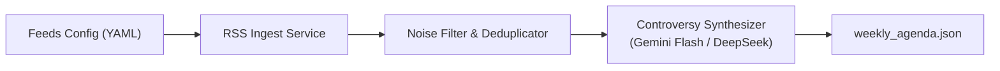

# Design: News Scraper & Weekly Agenda Engine

## Architecture Overview

El módulo de **Pauta Semanal (Editorial Desk)** se compone de cuatro capas desacopladas:



## 1. Data Contracts

### `FeedSource`
```typescript
export type Region = 'CL' | 'LATAM' | 'WORLD';

export interface FeedSource {
  id: string;
  name: string;
  url: string;
  region: Region;
  categoryDefault?: string;
}
```

### `RawArticle`
```typescript
export interface RawArticle {
  id: string;
  title: string;
  summary: string;
  contentSnippet?: string;
  url: string;
  source: string;
  region: Region;
  publishedAt: string;
}
```

### `WeeklyAgenda` & `DebateBlock`
```typescript
export interface DebateBlock {
  blockNumber: number;
  topic: string;
  region: Region;
  headlineGC: string; // Cintillo para Generador de Caracteres tipo TV
  factsSummary: string;
  moderatorTriggerQuestion: string;
  personaTriggers: Record<string, string>; // e.g. { karl_marx: "...", joven_incel: "..." }
}

export interface WeeklyAgenda {
  episodeId: string;
  theme: string;
  generatedAt: string;
  blocks: DebateBlock[];
}
```

## 2. Technology & Dependencies
- **Runtime:** Node.js (TypeScript con `tsx` o compilado).
- **RSS Parser:** `rss-parser` (rápido, sin dependencias nativas pesadas).
- **HTTP Client:** Nativo `fetch` (Node 22+).
- **LLM Client:** Conector ligero y compatible con OpenAI API format (Gemini vía Google AI Studio, o Ollama local — OpenRouter desactivado desde 2026-08-16).

## 3. Error Handling & Resilience
- Timeouts por feed: 6000ms con reintentos limitados.
- Degradación elegante: Si fallan medios de una región, el generador equilibra la pauta con las fuentes disponibles.
