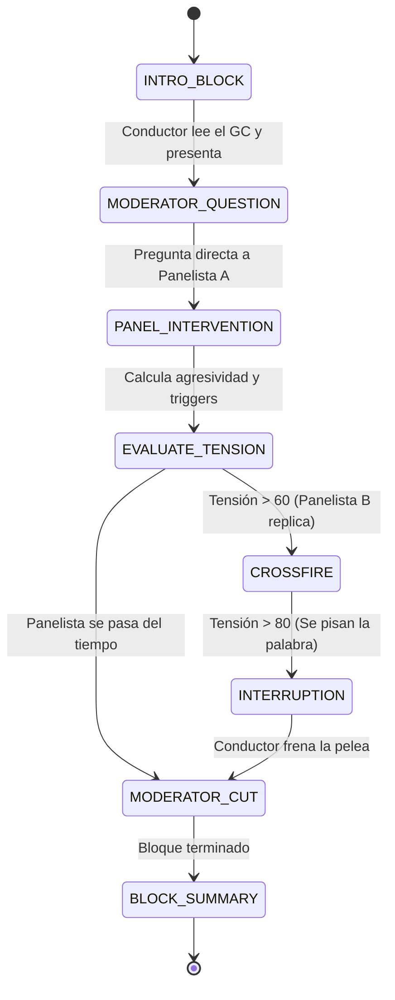

# Design: Multi-Agent Debate Engine & TV Orchestrator

## Architecture Overview



## 1. Domain Entities & Data Contracts

### `PersonaProfile`
```typescript
export type EmotionState = 'CALM' | 'TALKING' | 'ANGRY' | 'OUTRAGED' | 'SMUG' | 'MOCKING' | 'INTERRUPTING';

export interface PersonaProfile {
  id: string;
  name: string;
  archetype: string; // e.g. "Comunista Ortodoxo", "Joven Incel", "Fanático Religioso", "Moderador Sensacionalista"
  ideology: string;
  tone: string;
  aggressiveness: number; // 1-10
  catchphrases: string[];
  triggers: string[]; // Palabras/conceptos que lo hacen enfurecer
  avatarAssetId: string;
  voiceProfileId: string;
}
```

### `DebateTurn` & `DebateTranscript`
```typescript
export interface DebateTurn {
  turnId: number;
  blockNumber: number;
  speakerId: string;
  speakerName: string;
  isInterruption: boolean;
  emotion: EmotionState;
  speechText: string;
  cameraCue: 'SPEAKER_FOCUS' | 'SPLIT_SCREEN_VERSUS' | 'WIDE_PANEL' | 'REACTION_SHOT';
  targetSpeakerId?: string; // Si está atacando directamente a alguien
  estimatedDurationSec: number;
}

export interface DebateTranscript {
  episodeId: string;
  title: string;
  generatedAt: string;
  totalDurationSec: number;
  participants: PersonaProfile[];
  turns: DebateTurn[];
}
```

## 2. Dynamic Interruption Algorithm (Ponytail-Friendly)
- Cada intervención evalúa si menciona los `triggers` del rival ideológico.
- Si `tensionScore >= 75`, el orquestador programa un turno de interrupción inmediata con prefijos naturales (*"¡Momento!", "¡Eso es una aberración!", "¡Déjame terminar, no seas cínico!"*).

## 3. Integration with Local LLM
- Utiliza la API local de Ollama (`/v1/chat/completions`) apuntando al modelo cuantizado `hf.co/HauhauCS/Gemma4-12B-QAT-Uncensored-HauhauCS-Balanced:Q4_K_M`.
- **Sin OpenRouter:** el debate corre 100% local (Ollama → sintetizador heurístico offline).
