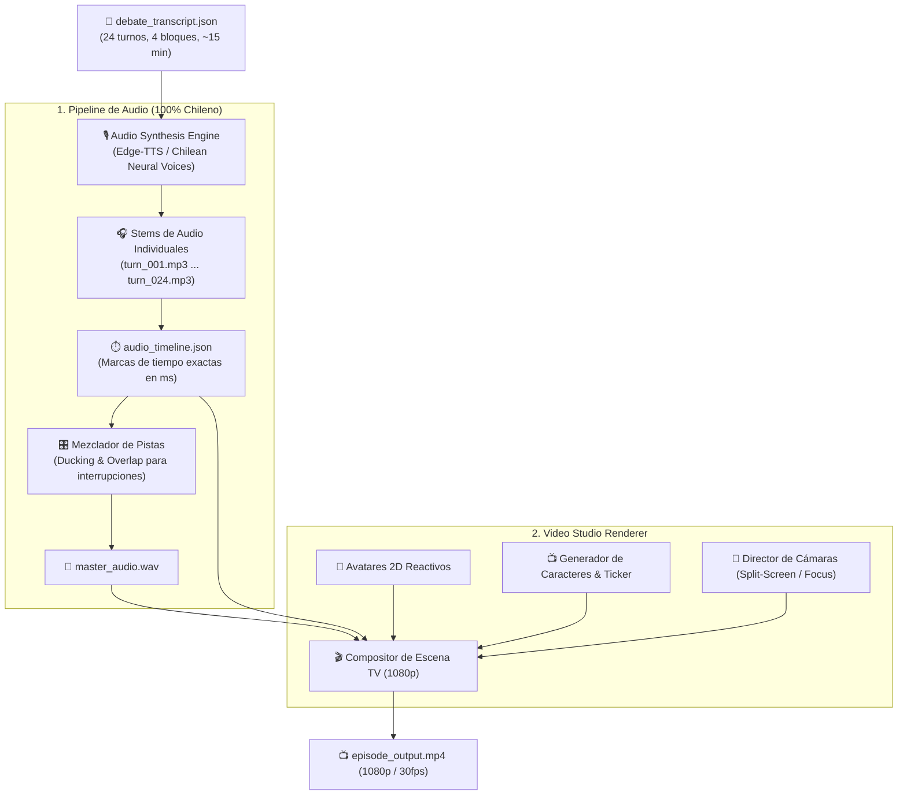

# Design: Multi-Voice TTS Audio Pipeline & TV Video Studio Renderer

## Architecture Overview



## 1. Mapeo de Voces 100% Chilenas por Personaje (`voiceProfileId`)

Utilizamos voces neuronales chilenas (`es-CL-LorenzoNeural` y `es-CL-CatalinaNeural`) con calibración precisa de *pitch* (tono) y *rate* (velocidad) para dar identidad auditiva única a cada uno de los 15 personajes chilenos:

| Personaje | `voiceProfileId` | Voz Neuronal Base | Ajustes (Pitch/Rate) | Registro Sociocultural Chileno |
| :--- | :--- | :--- | :--- | :--- |
| **Guzmán Falcón (Moderador)** | `voice_es_cl_moderator` | `es-CL-LorenzoNeural` | Rate +8%, Pitch +2Hz | Conductor de matinal chileno enérgico y picante |
| **Lautaro Moncada (Jota)** | `voice_es_cl_moncada` | `es-CL-LorenzoNeural` | Pitch -4Hz | Dirigente comunista poblacional combativo |
| **Capitán Sotomayor** | `voice_es_cl_sotomayor` | `es-CL-LorenzoNeural` | Pitch -8Hz, Rate -2% | Ex-Carabinero marcial, severo y tajante |
| **Dr. Aurelio Von Der Goltz** | `voice_es_cl_economista`| `es-CL-LorenzoNeural` | Rate -5%, Pitch -2Hz | Economista sobrio de Sanhattan / El Golf |
| **Profesor Belisario Valdebenito**| `voice_es_cl_jurista`| `es-CL-LorenzoNeural` | Rate -7%, Pitch -5Hz | Constitucionalista solemne y formal |
| **Don Clodomiro Montesinos** | `voice_es_cl_estadista` | `es-CL-LorenzoNeural` | Rate -6%, Pitch -7Hz | Estadista histórico de la Concertación / 30 Años |
| **Dr. Jean-Pascal Larraín** | `voice_es_cl_sociologo` | `es-CL-LorenzoNeural` | Rate -3%, Pitch -1Hz | Sociólogo intelectual de Plaza Ñuñoa |
| **Embajador Viktor Von Gluck**| `voice_es_cl_geopolitico`| `es-CL-LorenzoNeural` | Rate -4%, Pitch -4Hz | Diplomático chileno de carrera, frío y analítico |
| **Gaspar Mork (Chuquicamata)**| `voice_es_cl_mork` | `es-CL-LorenzoNeural` | Rate -6%, Pitch -10Hz | Sindicalista minero del cobre, voz ronca de minero |
| **Maximiliano Vondercrypt** | `voice_es_cl_ancap` | `es-CL-LorenzoNeural` | Rate +14%, Pitch +4Hz | Joven libertario cuico de Las Condes / Twitter |
| **Brayan Cyberpunk (Incel)** | `voice_es_cl_incel` | `es-CL-LorenzoNeural` | Rate +9%, Pitch +5Hz | Gamer e incel de Maipú, sarcástico y acelerado |
| **Pastor Isaías Benavides** | `voice_es_cl_pastor` | `es-CL-LorenzoNeural` | Rate +3%, Pitch +3Hz | Pastor evangélico pentecostal de Bajos de Mena |
| **Camila Ñuñoa-Vergara** | `voice_es_cl_nunoa` | `es-CL-CatalinaNeural` | Rate +2%, Pitch +3Hz | Activista de Plaza Ñuñoa, voz femenina con entonación ñuñoína |
| **Washington Chamorro** | `voice_es_cl_politico` | `es-CL-LorenzoNeural` | Rate +1%, Pitch -2Hz | Diputado populista de matinal, tono meloso |
| **Coronel (R) Von Stange** | `voice_es_cl_militar` | `es-CL-LorenzoNeural` | Rate -5%, Pitch -12Hz | Militar retirado de Providencia, marcial y carrasposo |

## 2. Modelos de Dominio (`src/types/media.ts`)

```typescript
export interface AudioStemInfo {
  turnId: number;
  speakerId: string;
  voiceProfile: string;
  filePath: string;
  durationMs: number;
  startMs: number;
  endMs: number;
  isInterruption: boolean;
}

export interface AudioTimeline {
  episodeId: string;
  totalDurationMs: number;
  stems: AudioStemInfo[];
  masterAudioPath: string;
}

export interface VideoRenderConfig {
  width: number; // 1920
  height: number; // 1080
  fps: number; // 30
  showTensionMeter: boolean;
  showTicker: boolean;
}
```

## 3. Composición Visual de Estudio TV (Layout 1920x1080)

1. **Header (Top 100px):** Logo de *Political Deathmatch* + Contador de Bloque + Indicador de Tensión (*Rating*).
2. **Main Stage (Middle 780px):**
   - Modo `SPEAKER_FOCUS`: Avatar del orador a tamaño 600px en el centro con animación de audio.
   - Modo `SPLIT_SCREEN_VERSUS`: Pantalla dividida con marco metálico y alerta de "¡INTERRUPCIÓN EN VIVO!".
   - Modo `WIDE_PANEL`: 5 asientos con todos los panelistas y el moderador.
3. **Lower Thirds / GC (Bottom 200px):**
   - Cintillo con fondo rojo/negro y titular en mayúsculas estilo matinal de debate.
   - Subtítulo con el nombre del personaje, alias y cargo.
   - Barra rodante inferior (*Breaking News Ticker*) con noticias de la semana.
