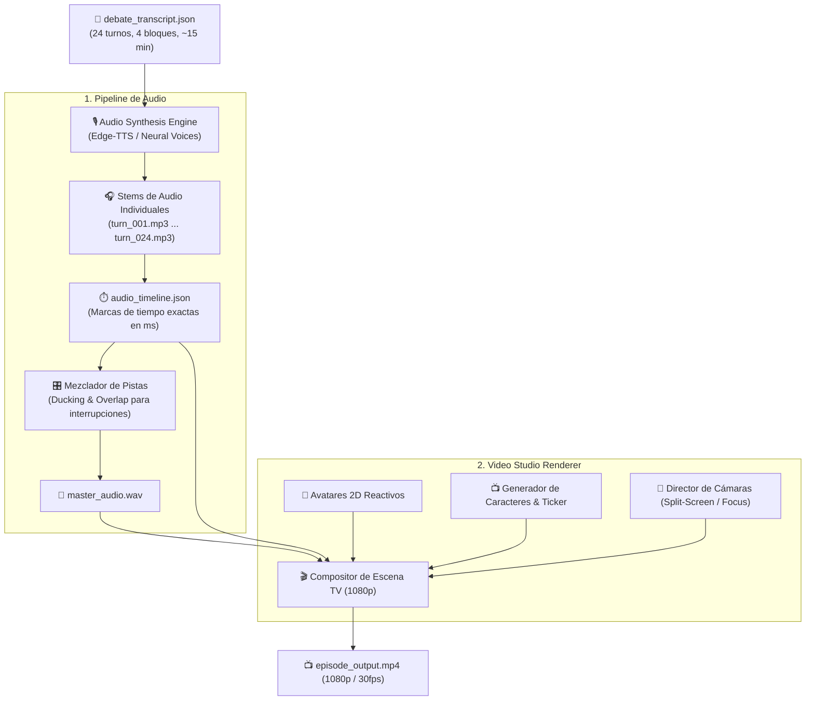

# Design: Multi-Voice TTS Audio Pipeline & TV Video Studio Renderer

## Architecture Overview



## 1. Mapeo de Voces por Personaje (`voiceProfileId`)

Utilizaremos voces neuronales multilenguaje de alta fidelidad:

| Personaje | `voiceProfileId` | Voz Neuronal Asignada | Registro / Acento |
| :--- | :--- | :--- | :--- |
| **Guzmán Falcón (Moderador)** | `voice_es_cl_moderator` | `es-CL-LorenzoNeural` | Chileno enérgico, televisivo |
| **Comandante Moncada** | `voice_es_latam_caudillo` | `es-VE-SebastianNeural` | Venezolano épico y resonante |
| **Capitán Sotomayor** | `voice_es_latam_punitivo` | `es-MX-JorgeNeural` (Pitch -5Hz) | Marcial, grave, imperativo |
| **Dr. Aurelio Von Der Goltz** | `voice_es_cl_economista` | `es-CL-LorenzoNeural` (Rate -5%) | Pausado, sobrio y técnico |
| **Profesor Valdebenito** | `voice_es_cl_jurista` | `es-ES-AlvaroNeural` (Solemne) | Castellano doctoral, solemne |
| **Don Clodomiro Montesinos** | `voice_es_cl_estadista` | `es-CL-LorenzoNeural` (Pitch -10Hz)| Veterano, pausado y reflexivo |
| **Dr. Jean-Pascal Larraín** | `voice_es_cl_sociologo` | `es-ES-ManuelNeural` | Articulado, intelectual |
| **Embajador Viktor Von Gluck** | `voice_es_latam_diplomatico` | `es-ES-AlvaroNeural` (Frío) | Diplomático, calculador |
| **Kaspar Mork (Comunista)** | `voice_es_de_mork` | `es-ES-AlvaroNeural` (Pitch -15Hz) | Profundo, severo, cavernoso |
| **Maximiliano Vondercrypt** | `voice_es_ar_ancap` | `es-AR-TomasNeural` (Rate +10%) | Argentino acelerado y exaltado |
| **Brayan Cyberpunk (Incel)** | `voice_es_cl_incel` | `es-CL-CatalinaNeural` / Joven | Juvenil, acelerado y sarcástico |
| **Pastor Isaías Benavides** | `voice_es_latam_pastor` | `es-CO-GonzaloNeural` (Exaltado) | Apostólico, teatral y vibrante |
| **Camila Ñuñoa-Vergara** | `voice_es_cl_nunoa` | `es-CL-CatalinaNeural` (Aguda) | Femenina, condescendiente |
| **Washington Chamorro** | `voice_es_cl_politico` | `es-CL-LorenzoNeural` (Meloso) | Paternalista, tono de matinal |
| **Coronel Von Stange** | `voice_es_cl_militar` | `es-CL-LorenzoNeural` (Grave + Golpe)| Marcial, carrasposo |

## 2. Modelos de Dominio (`src/types/media.ts`)

```typescript
export interface AudioStemInfo {
  turnId: number;
  speakerId: string;
  voiceProfile: string;
  filePath: string;
  durationMs: number;
  startMs: number;
  endMs: number;
  isInterruption: boolean;
}

export interface AudioTimeline {
  episodeId: string;
  totalDurationMs: number;
  stems: AudioStemInfo[];
  masterAudioPath: string;
}

export interface VideoRenderConfig {
  width: number; // 1920
  height: number; // 1080
  fps: number; // 30
  showTensionMeter: boolean;
  showTicker: boolean;
}
```

## 3. Composición Visual de Estudio (Layout 1920x1080)

1. **Header (Top 100px):** Logo de *Political Deathmatch* + Contador de Bloque + Indicador de Tensión (*Rating*).
2. **Main Stage (Middle 780px):**
   - Modo `SPEAKER_FOCUS`: Avatar del orador a tamaño 600px en el centro con animación de audio.
   - Modo `SPLIT_SCREEN_VERSUS`: Pantalla dividida con marco metálico y alerta de "RÉPLICA / COMBATE".
   - Modo `WIDE_PANEL`: 5 asientos con todos los panelistas y el moderador.
3. **Lower Thirds / GC (Bottom 200px):**
   - Cintillo con fondo rojo/negro y titular en mayúsculas.
   - Subtítulo con el nombre del personaje, alias y cargo.
   - Barra rodante inferior (*Breaking News Ticker*) con noticias de la semana.
